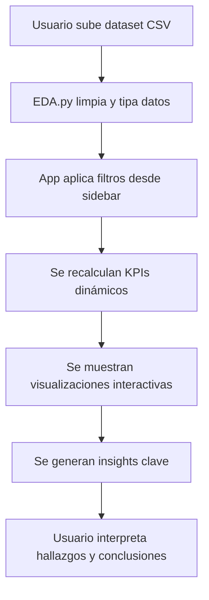

# Telco Customer Churn — Streamlit Apps

Plataforma **web interactiva** para el análisis exploratorio de datos (EDA) del dataset **Telco Customer Churn**, desarrollada con **Python**, **Streamlit**, **Pandas** y **Scikit-learn**.  
Incluye también un ejemplo adicional de construcción de modelos de Machine Learning con **Random Forest** y visualizaciones de métricas.

---

## Características Principales

| Funcionalidad | Descripción |
|---------------|-------------|
| **EDA Interactivo (app.py)** | Carga de dataset Telco Customer Churn, limpieza automática de variables y visualización dinámica con filtros. |
| **Filtros en sidebar** | Multiselect para contrato, servicio de internet, método de pago, género, senioridad; sliders para tenure, MonthlyCharges y TotalCharges; checkbox para clientes con churn = 1. |
| **KPIs dinámicos** | Tasa de churn, cargos promedio, tenure promedio y total de clientes (sobre el dataset filtrado). |
| **Visualizaciones** | Histogramas, boxplots, scatter interactivo, countplots comparativos, heatmap de correlación. |
| **Insights automáticos** | Generación de hallazgos clave (por contrato, servicio de internet, método de pago y tenure). |
| **KPIs por segmento** | Tabla segmentada que muestra churn %, tenencia promedio y cargos promedios por categoría. |
| **Ejemplo ML (Ejemplo1.py)** | Construcción de un modelo Random Forest con carga de CSV o dataset de ejemplo, entrenamiento, métricas de rendimiento y exportación de resultados en ZIP. |

---

## Flujo General de la App EDA



---

## Estructura del Proyecto

```
Mid_Machine/
  Streamlit/
    app.py          # App principal: EDA interactivo de Telco Churn
    EDA.py          # Funciones de limpieza y KPIs por segmento
    Ejemplo1.py     # Ejemplo adicional: Random Forest model builder
  pipeline/
    pipeline_telco_churn.ipynb   # Notebook de referencia (no requerido para ejecución)
requirements.txt
README.md
```

---

## Tecnologías

- **Python 3.10+**
- **Streamlit 1.36+** — interfaz web interactiva
- **Pandas 2.2+** — manipulación de datos
- **Matplotlib / Seaborn** — visualizaciones
- **Scikit-learn 1.4+** — imputación y modelado
- **Altair 5.3+** — gráficos interactivos (Ejemplo1.py)
- **NumPy 1.26+**

---

## Instalación

```bash
# 1) Clonar repositorio
git clone https://github.com/carloscastro4172/Machine-Learning
cd Machine-Learning/Mid_Machine

# 2) Crear entorno virtual
python -m venv .venv
.\.venv\Scripts\Activate.ps1   # En Windows PowerShell

# 3) Instalar dependencias
pip install --upgrade pip
pip install -r requirements.txt
```

---

## Ejecución

### 1) App principal — EDA Telco
```bash
streamlit run Streamlit/app.py
```
- Subir el archivo `WA_Fn-UseC_-Telco-Customer-Churn.csv`.  
- Navegar entre pestañas (*Distribuciones, Comparativo, Segmentación, Insights*).  
- Aplicar filtros en el sidebar para actualizar KPIs y gráficos en tiempo real.

### 2) App ejemplo — Model builder
```bash
streamlit run Streamlit/Ejemplo1.py
```
- Cargar un CSV o usar el dataset de ejemplo (solubilidad de drogas).  
- Ajustar parámetros del modelo Random Forest desde el sidebar.  
- Visualizar métricas de rendimiento, feature importance y predicciones.  
- Descargar datasets procesados y modelo en formato ZIP.

---

## Configuración de Limpieza (EDA.py)

1. Se elimina `customerID` por no aportar al análisis.  
2. `TotalCharges` → numérico, imputado con mediana en caso de vacíos.  
3. Variables binarias `Yes/No` (`Partner`, `Dependents`, `PhoneService`, `PaperlessBilling`, `Churn`) → mapeadas a `1/0`.  
4. Servicios con valor “No internet service” o “No phone service” → convertidos a “No”.  
5. Variables categóricas forzadas a tipo `string` para compatibilidad con Streamlit.  

---

## Lógica del Sistema (EDA)

1. **Carga de dataset** vía `st.file_uploader`.  
2. **Limpieza de datos** automática con `clean_dt()` en `EDA.py`.  
3. **Aplicación de filtros** desde el sidebar.  
4. **Cálculo de KPIs** y generación de visualizaciones interactivas.  
5. **Segmentación** con tabla de KPIs por categoría seleccionada.  
6. **Insights automáticos** basados en las variables principales del churn.  

---

## Licencia

[MIT](LICENSE)  
_Proyecto académico para prácticas de EDA y Streamlit._  

---

¿Dudas? Abre un Issue en el repositorio.  
